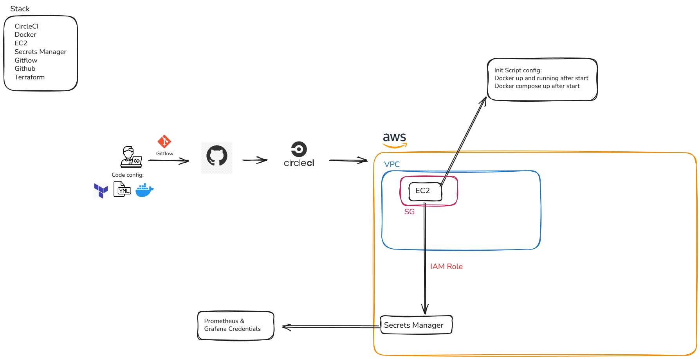

# AWS Observability Project

## Objetive
Deploy Prometheus and Grafana to AWS EC2 instance.

## Stack
* **AWS**: To host the server (EC2) and configure Secrets Manager (Optional).
* **Terraform**: To create the IaC.
* **CircleCI**: To run the deployment pipeline.
* **Docker**: To run Prometheus and Grafana in containers

## HLD Diagram



## Project Structure
```.
└── terraform
    ├── environments
    │   ├── dev
    │   │   ├── backend.tf
    │   │   ├── dev.tfvars
    │   │   ├── main.tf
    │   │   ├── outputs.tf
    │   │   ├── provider.tf
    │   │   ├── terraform.tfstate
    │   │   ├── terraform.tfstate.backup
    │   │   └── variables.tf
    │   └── prod
    │       ├── backend.tf
    │       ├── main.tf
    │       ├── outputs.tf
    │       ├── prod.tfvars
    │       ├── provider.tf
    │       ├── terraform.tfstate
    │       ├── terraform.tfstate.backup
    │       └── variables.tf
    ├── modules
    │   ├── compute
    │   │   ├── data.tf
    │   │   ├── main.tf
    │   │   ├── outputs.tf
    │   │   ├── scripts
    │   │   │   └── userdata.sh
    │   │   └── variables.tf
    │   └── network
    │       ├── main.tf
    │       ├── outputs.tf
    │       └── variables.tf
    └── terraform.tf
```
